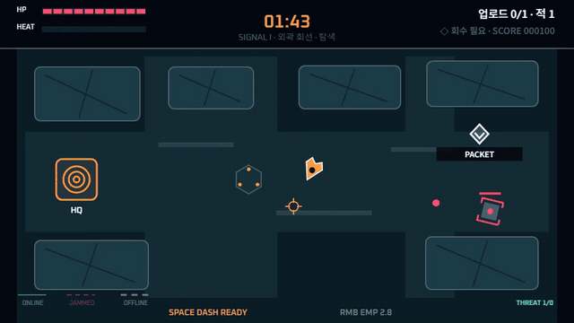

# Signal Courier

붕괴한 도시망을 가로질러 중계기를 설치하고, 패킷을 회수해 마지막 신호를 복구하는 싱글 플레이 2D 탑다운 액션 게임입니다. Hermes 운영 하네스의 목표 → 작업 → 실행 → 검증 → 학습 루프를 실제 게임 제작에 적용한 워크스페이스이기도 합니다.

<p align="center">
  <a href="docs/media/signal-courier-gameplay.mp4">
    
  </a>
</p>

<p align="center">
  <strong>GIF를 누르면 사운드가 포함된 약 58초 고화질 플레이 영상이 열립니다.</strong><br>
  실제 키보드·마우스 입력으로 60Hz 동기 녹화한 뒤 영상과 음향을 함께 2배속한 3구역 자동 플레이입니다.
</p>

## 게임 소개

전투의 목적은 적을 모두 쓰러뜨리는 데 있지 않습니다. 총격 속에서 이동 경로를 확보하고, 중계기를 지키며, 제한 시간 안에 패킷을 전달해야 합니다.

1. 위협을 피해 이동하거나 필요한 적을 처리합니다.
2. 소켓에서 `E`를 유지해 중계기를 설치합니다.
3. 엄폐물을 이용해 패킷 위치까지 진입합니다.
4. 중계기로 돌아와 패킷을 업로드합니다.
5. 더 좁은 동선과 강한 적이 기다리는 다음 구역으로 이동합니다.

3구역 업로드를 모두 완료하면 도시망이 복구됩니다. 남은 시간과 처치 수는 점수로 환산되며 전체 런 동안 누적됩니다.

## 세 구역

| 구역 | 제한 시간 | 적 | 필수 처치 | 압박 변화 |
|---|---:|---:|---:|---|
| SIGNAL I · 외곽 회선 | 105초 | 2 | 0 | 이동·설치·회수 흐름 학습 |
| SIGNAL II · 교차 구역 | 90초 | 4 | 2 | 교차 사선과 좁아진 우회로 |
| SIGNAL III · 붕괴 코어 | 75초 | 6 | 4 | 최고 이동·사격 속도와 중계기 피해 |

건물은 배경 장식이 아니라 플레이어, 추격자와 양측 투사체를 실제로 막는 엄폐물입니다. 후반 구역은 단순히 체력만 늘리지 않고 목표 위치, 사선, 통로와 적 조합을 함께 바꿉니다.

## 전투와 피드백

- 과열식 펄스 블래스터: 연속 사격과 냉각 타이밍 관리
- 대시: 이동 방향 또는 조준 방향으로 돌파하며 짧은 무적 획득
- EMP: 근거리 적과 탄환을 밀어내고 교란된 중계기를 즉시 복구
- 중계기 링크: 정상 청록 → 교란 자홍 → 단절 회색으로 색과 선 형태 변화
- Canvas FX: 사격, 명중, 처치, 피격, 대시, EMP, 중계기와 업로드 효과
- Web Audio: 외부 음원 없이 사건별 tone·noise를 합성하고 compressor로 출력 보호

## 빠른 시작

요구 사항은 Node.js 20.19+ 또는 22.12+와 최신 Chromium 계열 브라우저입니다.

```bash
npm install
npm run dev
```

터미널에 표시된 주소를 열고 `Enter`로 시작합니다.

## 조작

| 입력 | 동작 |
|---|---|
| `WASD`, 방향키 | 이동 |
| 마우스 이동 / 왼쪽 버튼 | 조준 / 사격 |
| `Space` | 대시 |
| 마우스 오른쪽 버튼 | EMP |
| `E` 길게 누르기 | 중계기 설치·수리·패킷 업로드 |
| `Enter` | 게임 시작·다음 구역 |
| `P` | 일시정지·계속 |
| `R` | 전체 런 재시작 |
| `F` / `Escape` | 전체 화면 전환 / 종료 |

세부 규칙은 [게임 컨트롤 문서](docs/game/CONTROLS.md)에 있습니다.

## 검증

```bash
npm run verify
```

검증은 다음을 한 번에 수행합니다.

- TypeScript와 프로덕션 Vite 빌드
- 순수 60Hz 시뮬레이션 단위·통합 테스트
- 상대 경로와 배포 라이선스 원문 검사
- 실제 DOM 입력 기반 Playwright 3구역 완주
- 점수·처치·구역 승계와 최종 승리 확인
- 3개 해상도, reduced-motion, 콘솔·페이지 오류 검사

게임은 자동화를 위해 두 계약을 유지합니다.

```ts
window.render_game_to_text(): string
window.advanceTime(milliseconds: number): void
```

화면 녹화는 동일한 Canvas와 Web Audio 출력을 사용하며 순간이동이나 상태 변경 전용 API를 사용하지 않습니다. 영상 export 명세와 SHA-256은 [미디어 매니페스트](docs/media/MANIFEST.yml)에 기록되어 있습니다.

## 기술 구성

- Vite 8 + TypeScript 5.9
- 단일 960×540 Canvas 2D 렌더링
- 60Hz 고정 스텝과 시드형 PRNG
- 순수 `GameState + InputFrame → stepGame` 코어
- Web Audio 절차 합성 음향
- Vitest + Playwright 입력·상태·화면 검증
- 런타임 패키지 의존성 0개

## 워크스페이스 구조

| 경로 | 역할 |
|---|---|
| `src/game/core/` | 수학, clock, PRNG와 권위 타입 |
| `src/game/model/` | 게임 상태와 입력 명령 |
| `src/game/systems/` | 이동·전투·중계기·레벨 진행 시뮬레이션 |
| `src/game/content/` | 세 구역과 밸런스 정의 |
| `src/game/adapters/browser/` | Canvas, DOM 입력, Web Audio |
| `src/game/debug/` | canonical hash와 텍스트 상태 |
| `docs/game/` | 게임 브리프, 조작, 아키텍처와 검증 규약 |
| `docs/media/` | README 플레이 영상과 export 기록 |
| `ops/` | 헌장, 보드, 지표, 작업·결정 기록 |
| `progress.md` | 구현과 검증 인계 기록 |

자세한 제작 기준은 [게임 브리프](docs/game/GAME-BRIEF.md), [아키텍처](docs/game/ARCHITECTURE.md), [운영 보드](ops/BOARD.md)를 참고하십시오.
