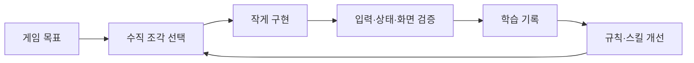

# Hermes Game Workspace

Hermes-Agent의 목표 → 작업 → 실행 → 검증 → 학습 루프를 게임 제작에 맞게 확장한 워크스페이스입니다. 운영 문서만 있는 템플릿이 아니라, 즉시 실행 가능한 Canvas/TypeScript 레퍼런스 게임과 에이전트 검증 계약을 함께 제공합니다.

## 빠른 시작

요구 사항: Node.js 20.19+ 또는 22.12+

```bash
npm install
npm run dev
```

브라우저에서 터미널에 표시된 주소를 열고 `Enter`로 시작합니다.

```bash
npm run check
npm run build
npm run preview
```

개발 서버를 `127.0.0.1:4173`에서 실행한 상태로 전체 플레이 상태를 검증합니다.

```bash
npm run dev -- --host 127.0.0.1 --port 4173
# 다른 터미널
npm run test:game
```

## 현재 레퍼런스 게임

`Signal Courier`는 워크스페이스 검증을 위한 교체 가능한 마이크로게임입니다. 제한 시간 안에 신호 노드 5개를 모두 수집하면 승리합니다.

- 이동: `WASD` 또는 방향키
- 시작: `Enter`
- 일시정지: `P`
- 재시작: `R`
- 전체 화면: `F`

조작의 단일 문서는 [게임 컨트롤](docs/game/CONTROLS.md)입니다.

## 운영 루프



1. [프로젝트 헌장](ops/CHARTER.md)에서 목표와 성공 기준을 확인합니다.
2. [운영 보드](ops/BOARD.md)에서 완료 조건이 있는 `Ready` 작업 하나를 `Doing`으로 옮깁니다.
3. [작업 기록 템플릿](ops/tasks/TEMPLATE.md)으로 구현과 검증 증거를 남깁니다.
4. `npm run check`, `npm run build`, Playwright 플레이 루프로 검증합니다.
5. 재사용할 가치가 있는 교훈만 [프로젝트 메모리](ops/MEMORY.md) 또는 `.agents/skills/`로 승격합니다.

## 구조

| 경로 | 역할 |
|---|---|
| `src/` | 게임 코드와 스타일 |
| `public/assets/` | 번들 변환이 필요 없는 게임 에셋 |
| `docs/game/` | 게임 브리프, 조작, 아키텍처, 검증 규약 |
| `ops/CHARTER.md` | 목표, 범위, 성공 기준 |
| `ops/BOARD.md` | 현재 작업의 단일 현황판 |
| `ops/tasks/` | 작업 단위 가설, 결과, 증거 |
| `ops/decisions/` | 장기 영향을 주는 기술·디자인 결정 |
| `ops/MEMORY.md` | 짧고 검증된 프로젝트 지식 |
| `.agents/skills/` | 두 번 이상 검증된 반복 절차 |
| `progress.md` | 구현 에이전트 간 상세 인계 기록 |

원본 운영 철학과 전체 규칙은 [프로젝트 운영 플레이북](docs/process/PROJECT-OPERATING-SYSTEM.md)을 참고하십시오.
