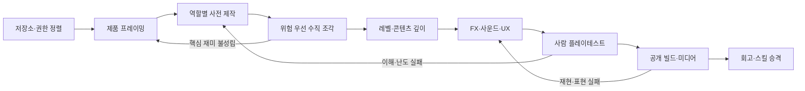

# 게임 제작 기준선

이 문서는 소규모 게임을 새로 시작하거나 프로토타입을 정식 프로젝트로 전환할 때 사용하는 공통 제작 절차다. 특정 장르, 엔진, 그래픽 스타일을 지정하지 않는다. 단계마다 다음 투자를 결정할 수 있는 증거를 남기는 데 목적이 있다.

실행용 Codex 스킬은 [game-production-baseline](../../.agents/skills/game-production-baseline/SKILL.md)에 있고, 새 저장소용 문서 묶음은 스킬의 `assets/starter-workspace/`에 있다.

## 전체 흐름



각 게이트의 판정은 네 가지다.

- `Pass`: 증거가 주장을 뒷받침한다.
- `Repair`: 가설은 유지하고 결함을 고친다.
- `Reframe`: 제품 또는 기술 가정을 바꾸고 이전 단계로 돌아간다.
- `Stop`: 기대 가치보다 비용·위험이 크다.

## 단계별 기준

| 단계 | 먼저 결정할 것 | 필수 산출물 | 통과 증거 |
|---|---|---|---|
| 저장소·권한 | 새 Git, 원격, 모델·도구 접근, 비용·다운로드, 라이선스 | 실행 규칙, 운영 문서, 첫 작업 | 빈 환경 설치·실행, 템플릿 Git 이력 분리 |
| 제품 프레이밍 | 대상, 반복 동사, 세션 길이, 성공·실패, 플랫폼·입력, 비범위 | 한 페이지 브리프, 성공 지표, 상위 위험 | 핵심 루프와 첫 수직 조각의 종료 상태를 한 문장으로 설명 |
| 사전 제작 | 규칙, 엔진, 상태·시간, 아트·UX, 사운드, 에셋, 내러티브 | 게임·기술·크리에이티브 계획, ADR, M1 범위 | 역할별 충돌이 통합 계획에서 해소됨 |
| 수직 조각 | 가장 위험한 플레이어 행동 | 시작부터 성공·실패·재시작까지 가능한 빌드 | 실제 입력, 중간 상태, 결과 화면, 오류 없음 |
| 콘텐츠·도전 | 각 단위의 학습 목적과 압력 축 | 레벨·퍼즐·조우 표, 밸런스 데이터, 완료 가능성 검사 | 전 단위 완료 가능, 규칙·공간·정보·압력 차이 확인 |
| 필·UX | 중요한 게임 사건의 예고·발생·결과 | 사건-규칙-VFX-SFX-HUD 대응표 | 빠른 장면에서도 행동 결과와 다음 목표 판독 |
| 사람 검증 | 사전 성공 기준과 관찰 방식 | 무설명 테스트 기록, 수정·진행·중단 결정 | 사람 대상 기준 충족 또는 재현 가능한 수정 작업 |
| 공개·릴리스 | 배포 환경과 방문자에게 필요한 정보 | 클린 빌드, README, 영상, 크레딧·라이선스 | 새 환경 실행, 링크·해시, A/V 사건 싱크, 문체 검토 |
| 회고 | 제품 문제와 제작 과정 문제의 구분 | 결과, 재작업 원인, 메모리·ADR·스킬 후보 | 공통 절차와 프로젝트 고유 사실이 분리됨 |

## 역할 구조

코디네이터가 범위, 통합, 증거와 게이트 판정을 소유한다. 전문 역할은 필요한 위험만 담당한다.

- 게임 디자이너: 플레이어 약속, 핵심 루프, 규칙, 보상·실패, 밸런스 가설
- 스토리텔러: 플레이에 필요한 맥락, 용어, 짧은 상태 문구. 서사가 조작 설명을 대신하지 않게 함
- 기술 설계자: 엔진·스택, 모듈 경계, 상태·입력·시간·저장, 배포와 테스트 전략
- 게임플레이 프로그래머: 같은 규칙 경로를 사용하는 실제 플레이와 자동화, 오류 처리
- 레벨·콘텐츠·퍼즐 디자이너: 학습·시험·변주, 공간·자원·정보 배치, 해법·실패 경로와 난도 곡선
- 그래픽·UX 디자이너: 기능 팔레트, 실루엣, HUD 우선순위, 입력 안내, 접근성
- 사운드 디자이너: 사건별 SFX 언어, 중요도, 동시 발음, 믹스와 음소거 상태
- 에셋·라이선스 담당: 제작·무료 다운로드·구매 판단, 출처·권리·해시·변환 기록
- QA·플레이테스트: 규칙 회귀, 실제 입력, 화면·상태·소리 대조, 사람 관찰
- 릴리스·쇼케이스: 클린 빌드, 플레이 영상, README, 크레딧과 공개 링크

인수인계는 결정한 것, 만든 것, 검증 결과, 남은 위험, 다음 결정의 다섯 항목으로 제한한다. 같은 파일을 여러 역할이 동시에 수정하지 않으며, 구현과 독립 승인을 가능한 한 분리한다.

## 공통 인터페이스: 게임 사건 표

역할 간 중심 문서는 사건 대응표다.

| 사건 | 규칙 결과 | VFX | SFX | HUD·문구 | 자동 검증 | 필수 캡처 |
|---|---|---|---|---|---|---|
| 예: 공격 명중 | 대상 체력 감소 | 접촉 위치 spark | 짧은 impact | 필요할 때 피해값 | 투사체 제거와 체력 변화 | 적중 순간 |

사건 ID 하나에서 규칙, 화면과 소리를 파생하면 타격감과 QA가 분리되지 않는다. 우선순위는 입력 수락, 명중, 플레이어 피해, 처치, 능력, 목표 상태, 구역 전환, 성공·실패다.

## 에셋 결정

직접 제작 또는 절차 생성을 우선하는 대상:

- 게임 정체성을 만드는 플레이어, 적, 목표물과 핵심 환경
- 상태 의미가 있는 HUD, 링크, VFX와 짧은 사건 SFX
- 외부 팩 사용 시 판독이나 스타일이 깨지는 요소

검증된 외부 자산이 효율적인 대상:

- 입력 글리프, 글꼴, 범용 질감·UI 원재료
- 표준 정확성이 제품 차별성보다 중요한 요소
- 출처와 상업 이용·수정·재배포·귀속 조건이 명확한 파일

출처 또는 권리가 불명확한 파일, 사용할 계획이 없는 대형 팩, 대규모 재가공이 필요한 에셋은 받지 않는다. 반입 시 원출처, 제작자, 라이선스 원문, 원본 해시, 선택 파일, 변환, 런타임 매핑과 Credits를 기록한다.

## 검증 사다리

```text
정적 검사
→ 규칙 단위·통합 검사
→ production build
→ 실제 키·포인터·패드 입력
→ 구조화된 상태 관찰
→ 화면 직접 확인
→ 소리 청취·사건 시점 측정
→ 설명 없는 사람 플레이테스트
```

낮은 단계가 높은 단계를 대신하지 않는다. 자동 완주는 기능과 도달 가능성을 증명하지만 재미, 피로, 난도, 재도전 의향은 증명하지 않는다.

입력 증거도 구분한다. 모델 action replay는 규칙 재현, 엔진 input event는 장면 통합, OS 수준 입력은 실제 배포 조작을 증명한다. 실시간 게임은 가능하면 규칙 상태를 렌더·입력·오디오와 분리하고 같은 입력을 재현할 수 있게 한다. 기술 선택이 다르면 고정 60Hz나 특정 API를 강제하지 않고, 같은 조건에서 결과를 관찰할 수 있는 동등한 계약을 만든다.

## 이번 제작의 재작업에서 배운 것

### 레벨

좌표와 충돌 수치가 유효해도 통로가 사실상 막히거나 적이 건물에 겹칠 수 있었다. 데이터 검사 뒤에 실제 이동 경로와 화면 확인을 추가해야 한다. 공간 게임은 경로·충돌·소프트락을, 퍼즐·카드 게임은 해법·교착·지름길·행동 예산·되돌리기를 검사한다. 난이도는 체력이나 숫자 하나만 올리지 않고 장르에 맞는 한두 축을 단계별로 바꾼다.

### FX와 사운드

효과 목록을 늘리는 대신 같은 게임 사건에 시각·음향·상태 피드백을 연결해야 했다. 과밀 구간에서 중요한 소리가 묻히지 않는지, reduced-motion이나 음소거에서도 상태를 알 수 있는지 확인한다.

### 플레이 영상

여러 시뮬레이션 tick을 한 영상 frame에 몰아 넣자 화면은 중간 동작을 건너뛰고 소리는 현재 시간에 몰렸다. 녹화 중 렌더와 시뮬레이션의 시간 대응을 유지하고, 느린 스크린샷 작업을 녹화 루프에서 분리한다. A/V는 전체 길이만 보지 않고 타격·완료·구역 전환 frame과 파형을 함께 확인한다.

### 공개 문서

기술 중심 설명과 명령형 구호는 방문자가 게임을 이해하는 데 도움이 되지 않았다. README와 시작 화면은 게임 방식, 실행, 조작과 현재 범위를 사실 문장으로 설명한다.

## 프로젝트 고유 요소는 복사하지 않는다

세계관, 장르명, 레벨 수, 제한 시간, 적 수, 점수, 키 배치, 색상, Canvas·Web Audio, 프레임률과 특정 지연 보정값은 이 게임의 결정이다. 다음 게임에서는 플랫폼, 제작자, 배포, 입력과 플레이 가설을 기준으로 다시 선택한다.

## 새 게임 시작 순서

1. starter workspace에서 필요한 파일만 새 저장소에 복사한다.
2. 모든 대괄호 항목을 새 게임 정보로 채우고 쓰지 않는 문서를 지운다.
3. 제품·기술·크리에이티브 역할에 서로 겹치지 않는 사전 제작 조사를 맡긴다.
4. 코디네이터가 결과를 한 브리프, ADR과 M1 작업으로 통합한다.
5. 가장 위험한 플레이 동사를 1~3분 수직 조각으로 구현한다.
6. 실제 입력·상태·화면·오류 증거를 잠근 뒤 레벨과 콘텐츠를 늘린다.
7. 사건 대응표에 따라 FX·사운드·UX를 함께 보강한다.
8. 사람 검증 후 공개 빌드와 실제 플레이 영상을 만든다.
9. 재작업 원인을 회고하고 반복 가능한 절차만 스킬로 승격한다.
