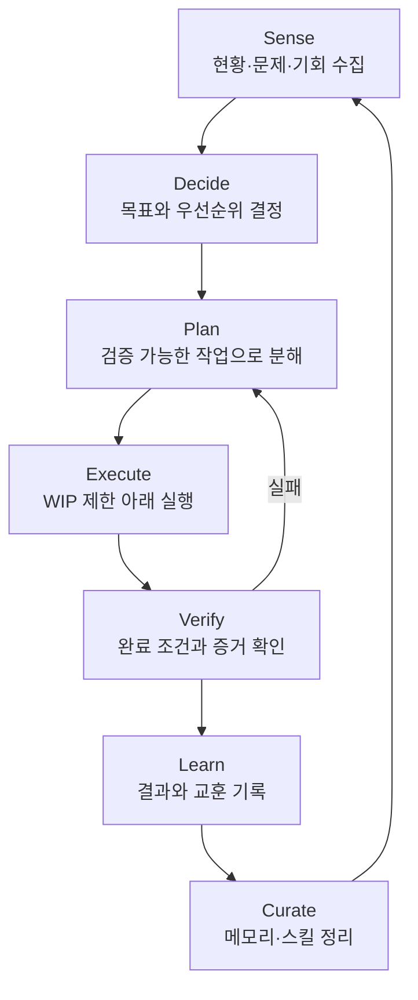

# 프로젝트 운영 플레이북

## 1. 목적

이 운영체계의 목적은 작업 목록을 관리하는 것이 아니라 다음 세 가지를 동시에 개선하는 것입니다.

1. **전달 능력**: 가치 있는 결과를 예측 가능하게 완료한다.
2. **판단 능력**: 측정과 검증을 통해 더 나은 결정을 내린다.
3. **학습 능력**: 경험을 메모리와 절차로 전환해 다음 작업의 비용을 낮춘다.

Hermes Agent에서 다음 발상을 차용했습니다.

| Hermes의 구조 | 프로젝트 운영체계로 변환 |
|---|---|
| Context files | `AGENTS.md`와 프로젝트 헌장에 지속 규칙 저장 |
| Bounded memory | `ops/MEMORY.md`에 작고 검증된 사실만 유지 |
| Skills | 반복 가능한 절차를 `.agents/skills/`에 저장 |
| Self-improvement loop | 완료 작업에서 학습 후보를 추출하고 스킬로 승격 |
| Curator | 주간 리뷰에서 사용량·효과를 보고 유지, 병합, 보관 |
| Cron | 일간·주간·월간 점검을 일정화 |
| Audit and rollback | Git 이력, PR, 의사결정 기록으로 변경을 추적하고 복원 |

## 2. 전체 루프



각 단계의 필수 산출물은 다음과 같습니다.

| 단계 | 질문 | 산출물 |
|---|---|---|
| Sense | 무엇이 달라졌는가? | 문제, 피드백, 지표 |
| Decide | 지금 무엇이 가장 중요한가? | 헌장, 우선순위, 결정 기록 |
| Plan | 어떻게 완료 여부를 알 수 있는가? | 실행 작업, 완료 조건, 검증 방법 |
| Execute | 가장 작은 안전한 변화는 무엇인가? | 코드, 문서, 운영 변경 |
| Verify | 주장이 아니라 어떤 증거가 있는가? | 테스트, 측정값, 리뷰, 링크 |
| Learn | 다음번에 무엇을 다르게 할 것인가? | 학습 후보, 후속 작업 |
| Curate | 무엇을 규칙이나 스킬로 남길 것인가? | 메모리 갱신, 스킬 승격·병합·보관 |

## 3. 목표에서 작업까지

### 프로젝트 헌장

헌장은 분기 또는 큰 마일스톤마다 갱신합니다. 다음 항목만 유지합니다.

- 해결하려는 문제
- 성공 지표와 목표값
- 범위와 비범위
- 핵심 제약
- 현재의 가장 큰 위험

### 작업 계층

```text
Outcome ── 원하는 사용자·사업 결과
  └─ Epic ── 결과를 만드는 큰 변화
      └─ Task ── 1~3일 안에 검증 가능한 실행 단위
          └─ Commit ── 하나의 목적을 가진 변경 단위
```

Task는 다음 Definition of Ready를 만족해야 합니다.

- 목표와 기대 효과가 분명하다.
- 결과물이 구체적이다.
- 완료 조건이 관찰 가능하다.
- 검증 방법을 실행할 수 있다.
- 의존성과 위험을 알고 있다.
- 보통 1~3일 안에 완료할 수 있다.

## 4. 흐름 관리

보드 상태는 `Backlog → Ready → Doing → Review → Done`으로 고정합니다.

- **Backlog**: 가치가 있으나 아직 실행 준비가 되지 않은 후보
- **Ready**: 완료 조건과 검증 방법이 준비된 작업
- **Doing**: 현재 실행 중인 작업
- **Review**: 결과물은 나왔고 독립 검증을 기다리는 작업
- **Done**: 검증과 기록까지 완료된 작업

WIP 제한은 `Doing` 1개/사람, `Review` 2개/팀을 기본값으로 둡니다. 새 일을 시작하기보다 막힌 일을 해결하고 검토를 끝내는 것이 우선입니다.

## 5. 완료와 검증

Definition of Done:

- 요구한 결과물이 존재한다.
- 모든 완료 조건을 통과했다.
- 관련 테스트 또는 검증 절차가 성공했다.
- 실패 시 되돌리거나 완화할 방법이 있다.
- 운영 보드와 관련 문서가 최신 상태다.
- 중요한 발견은 학습 후보로 기록됐다.

검증 증거의 우선순위는 자동 테스트와 측정값, 재현 가능한 수동 절차, 동료 리뷰, 설명 순입니다. 설명만 있는 작업은 검증된 것으로 간주하지 않습니다.

## 6. 지식 계층

모든 기록을 메모리로 올리지 않습니다.

| 계층 | 보관 대상 | 수명 |
|---|---|---|
| 작업 기록 | 시도, 로그 요약, 일회성 맥락 | 작업 단위 |
| 결정 기록 | 선택지와 장기 영향이 있는 결정 | 결정이 유효한 동안 |
| 프로젝트 메모리 | 여러 작업에 필요한 검증된 사실·제약 | 짧고 지속적 |
| 스킬 | 반복 실행 가능한 절차 | 사용성과 효과가 있는 동안 |

메모리 등록 기준:

- 다음 세션에서 다시 알아내는 비용이 큰가?
- 여러 작업에 영향을 주는가?
- 구체적이고 행동 가능한가?
- 현재 문서의 다른 위치와 중복되지 않는가?

하나라도 불명확하면 작업 기록에 남겨 두고 승격하지 않습니다. 메모리는 기본 40개 항목 이하로 유지하며 80%를 넘으면 추가하기 전에 병합하거나 오래된 항목을 내립니다.

## 7. 스킬 승격 규칙

다음 조건을 모두 충족하면 학습 후보를 스킬로 승격합니다.

1. 같은 종류의 작업에서 두 번 이상 사용되었다.
2. 성공 여부를 확인하는 방법이 있다.
3. 특정 사건의 기록이 아니라 재현 가능한 절차다.
4. 기존 스킬에 작은 수정으로 흡수할 수 없는 독립된 책임이 있다.

스킬은 다음 구조를 사용합니다.

```text
.agents/skills/<skill-name>/
├── SKILL.md
├── references/   # 필요할 때만 읽는 상세 지식
├── templates/    # 반복 산출물
└── scripts/      # 결정론적으로 자동화할 수 있는 부분
```

모든 `SKILL.md`에는 `When to Use`, `Procedure`, `Pitfalls`, `Verification`을 포함합니다.

## 8. 큐레이션 주기

Hermes의 curator처럼 지식도 생명주기를 갖습니다.

| 상태 | 기준 | 조치 |
|---|---|---|
| Active | 최근 사용되었고 효과가 확인됨 | 유지 또는 작은 개선 |
| Stale | 30일 이상 미사용 또는 현실과 불일치 가능 | 재검증 대상으로 표시 |
| Archived | 90일 이상 미사용 또는 더 나은 절차로 대체 | 복구 가능한 위치로 이동 |
| Pinned | 핵심 운영·안전 절차 | 자동 보관 금지, 내용 개선은 허용 |

정리 순서는 항상 `백업/커밋 → dry-run 검토 → 변경 → 검증`입니다. 삭제보다 병합과 보관을 우선합니다.

## 9. 운영 리듬

### 매일 5~10분

- `Doing`과 막힘을 확인한다.
- 완료된 작업의 증거를 확인한다.
- 새 작업보다 리뷰 대기 작업을 먼저 처리한다.

### 매주 30~45분

- 목표 대비 결과와 흐름 지표를 확인한다.
- 오래 막힌 작업을 축소, 분할 또는 중단한다.
- 학습 후보를 메모리, 결정, 스킬, 폐기로 분류한다.
- 스킬의 사용과 효과를 검토하고 중복을 병합한다.
- 다음 주에 검증할 개선 실험을 하나만 선택한다.

### 매월 60분

- 헌장과 성공 지표가 여전히 유효한지 확인한다.
- `stale` 지식과 스킬을 재검증하거나 보관한다.
- 반복되는 실패가 개인 문제가 아니라 시스템 규칙으로 해결됐는지 확인한다.
- 프로세스 비용이 결과 향상보다 커진 부분을 제거한다.

## 10. 성장 지표

지표는 사람 평가가 아니라 시스템 개선에만 사용합니다.

| 지표 | 계산 | 해석 |
|---|---|---|
| Lead time | Doing 시작부터 Done까지 | 전달 속도 |
| Throughput | 주간 Done 작업 수 | 완료 능력 |
| Blocked ratio | 막힌 시간 / 전체 리드타임 | 의존성 건강도 |
| Rework rate | 완료 후 재작업 수 / Done 수 | 품질과 요구 이해도 |
| Learning yield | 유효 학습 후보 수 / Done 수 | 경험의 지식 전환률 |
| Skill reuse | 기존 스킬 사용 작업 수 / 전체 작업 수 | 절차 자산의 활용도 |
| Skill success | 스킬 사용 후 검증 성공 / 스킬 사용 수 | 절차의 실제 효과 |

한 번에 모든 지표를 최적화하지 않습니다. 매주 병목과 가장 가까운 지표 하나를 선택합니다.

## 11. 도입 순서

### 1주차: 가시성

- 헌장 작성
- 보드와 WIP 제한 적용
- 작업마다 완료 조건과 검증 증거 기록

### 2주차: 학습

- 주간 리뷰 시작
- 프로젝트 메모리와 결정 기록 분리
- 반복된 해결법을 학습 후보로 수집

### 3~4주차: 재사용

- 검증된 후보만 스킬로 승격
- 스킬 사용 여부와 성공 결과 기록
- 오래되거나 중복된 규칙을 병합

### 이후: 자동화

- 일간 보드 점검과 주간 리뷰 알림을 일정화
- 결정론적인 검사만 스크립트나 CI로 자동화
- 자율적인 메모리·스킬 변경은 먼저 제안과 diff 검토 단계를 둠

## 참고 자료

- [Hermes Agent 저장소](https://github.com/nousresearch/hermes-agent)
- [Hermes Skills System](https://hermes-agent.nousresearch.com/docs/user-guide/features/skills/)
- [Hermes Persistent Memory](https://hermes-agent.nousresearch.com/docs/user-guide/features/memory/)
- [Hermes Curator](https://hermes-agent.nousresearch.com/docs/user-guide/features/curator)
- [Hermes Context Files](https://hermes-agent.nousresearch.com/docs/user-guide/features/context-files/)
- [Hermes Scheduled Tasks](https://hermes-agent.nousresearch.com/docs/user-guide/features/cron/)

